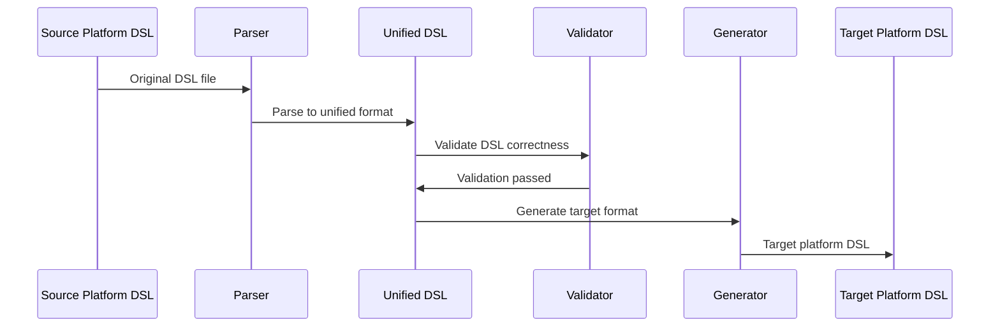

# AgentBridge

[English](README.en.md) | [简体中文](README.md)

> **The world's first cross-platform AI agent platform compatibility tool**
>
> With just a single binary file, you can locally achieve seamless conversion of DSL files between different AI agent platforms (iFlytek, Dify, Coze), enabling AI agent workflow ecosystem interoperability. Using iFlytek (Spark Agent) as the hub, it unifies parsing into intermediate DSL, then generates according to the target platform, supporting automatic recognition, concurrent batch processing, and strict validation.

---

## Table of Contents
- [Project Overview](#overview)
- [Visualization](#visuals)
- [Quick Start](#quickstart)
- [CLI Reference](#cli)
- [Development & Testing](#dev)
- [FAQ](#faq)
- [License & Credits](#license)

---

<a id="overview"></a>
## Project Overview

### Supported Conversion Paths
- Dify ↔ iFlytek (bidirectional)
- Coze ↔ iFlytek (bidirectional, YAML)
- Dify → iFlytek → Coze (recommended path)
- Coze → iFlytek → Dify
- Coze ZIP → iFlytek (native support)

Not supported:
- Dify ↔ Coze direct conversion (please use iFlytek as hub)
- iFlytek → Coze ZIP (currently does not support ZIP target format)

### Fault Tolerance & Placeholder Strategy
To maintain workflow structure integrity when encountering node types not supported by the target platform:
- Use "code node" as placeholder to replace the node
- Write the original node's specific type in the code node title for easy manual adjustment later
- Preserve input/output edge connections so the flow can continue running
- Under `--verbose`, output details and statistics, such as:
  - Converting unsupported node type '4' (ID: 133604) to code node placeholder
  - 25 unsupported nodes were converted to code node placeholders

### Core Features
- Concurrent batch: `batch` command uses CPU concurrency, supports file mode and overwrite
- Validation pipeline: structure/semantic/platform three-level validation with friendly error messages
- Node coverage: start / end / llm / code / condition / classifier / iteration

### Coze YAML Support
- Current status: Coze official workflow does not support YAML import/export
- Solution: We maintain a fork that provides YAML import/export capabilities
- Repository: `https://github.com/2064968308github/coze_transformer`
- Usage: First use that repository to get Coze YAML, then use this tool for cross-platform conversion (e.g., Coze YAML → iFlytek, or iFlytek → Coze YAML)

<a id="visuals"></a>
## Visualization

<a id="visuals-paths"></a>
### Conversion Path Diagram


<a id="visuals-seq"></a>
### Conversion Flow Sequence Diagram


<a id="visuals-arch"></a>
### Project File Structure
```
agentbridge/
├── cmd/                    # CLI entry
│   ├── main.go            # Main program
│   ├── convert.go         # Convert command
│   └── validate.go        # Validate command
├── core/                  # Core services
│   └── services/          # Conversion service implementation
├── platforms/             # Platform implementations
│   ├── iflytek/          # iFlytek platform
│   ├── dify/             # Dify platform
│   └── coze/             # Coze platform
├── internal/             # Internal models
│   └── models/           # Unified DSL definition
└── registry/             # Strategy registry
```

<a id="visuals-png"></a>
### Project Architecture Diagram


<a id="quickstart"></a>
## Quick Start

<a id="build"></a>
### Installation & Build

**Environment Requirements: Go 1.21+**

#### Windows (Recommended)
```powershell
# Ensure Go 1.21+ is installed
go version

# Build project
go build -o agentbridge.exe ./cmd/
./agentbridge.exe --help
```
If a file with the same name but no extension exists in the directory, PowerShell might show "Choose app to open". Keep only the `.exe` file.

#### macOS / Linux
```bash
# Ensure Go 1.21+ is installed
go version

# Build project
go build -o agentbridge ./cmd/
chmod +x ./agentbridge
./agentbridge --help
```

### Usage Examples
The following examples are executed in the project root directory.

### Windows (PowerShell)
```powershell
# iFlytek → Dify
./agentbridge.exe convert --from iflytek --to dify --input agent.yml --output dify.yml

# Dify → iFlytek
./agentbridge.exe convert --from dify --to iflytek --input dify.yml --output agent.yml

# iFlytek → Coze (YAML)
./agentbridge.exe convert --from iflytek --to coze --input agent.yml --output coze.yml

# Coze ZIP → iFlytek (ZIP automatically detected as Coze)
./agentbridge.exe convert --to iflytek --input workflow.zip --output agent.yml --verbose

# Batch (concurrent, overwrite)
./agentbridge.exe batch --from iflytek --to dify --input-dir .\tests\fixtures\iflytek --pattern 'iflytek*.yml' --output-dir .\out --workers 4 --overwrite

# Validate DSL
./agentbridge.exe validate --input agent.yml

# Quiet mode (error output only)
./agentbridge.exe convert --from iflytek --to dify --input agent.yml --output dify.yml --quiet
```
Tip: Must use `.exe`; recommend single quotes for `--pattern`.

### macOS / Linux (Terminal)
```bash
# iFlytek → Coze (YAML)
./agentbridge convert --from iflytek --to coze --input agent.yml --output coze.yml

# Dify → iFlytek
./agentbridge convert --from dify --to iflytek --input dify.yml --output agent.yml

# Auto detection (YAML)
./agentbridge convert --to dify --input agent.yml --output dify.yml --verbose

# Batch (default concurrency)
./agentbridge batch --from iflytek --to dify --input-dir ./workflows --output-dir ./converted --workers 8 --overwrite

# Validate
./agentbridge validate --input agent.yml
```

<a id="cli"></a>
## CLI Reference (Complete)
The following examples are executed at project root by default; use `./agentbridge.exe` on Windows, `./agentbridge` on macOS/Linux.

### convert
- Purpose: Cross-platform conversion
- Required: `--to`, `--input/-i`, `--output/-o`
- Optional: `--from` (auto-detect when omitted, ZIP→Coze)
- Limitations: Does not support Dify↔Coze direct connection; does not support iFlytek→Coze ZIP

### validate
- Purpose: Validate DSL (structure/semantic/platform)
- Required: `--input/-i`
- Optional: `--from` (auto-detect when omitted)

### batch
- Purpose: Concurrent batch conversion
- Required: `--from`, `--to`, `--input-dir`, `--output-dir`
- Optional: `--pattern` (default `*.yml`), `--workers` (CPU-based by default), `--overwrite`, global `--quiet/--verbose`

### info
- Purpose: View capability description
- Options: `--nodes`, `--types`, `--all`

### platforms
- Purpose: View supported platforms and status
- Options: `--detailed`

### completion (optional)
- Purpose: Generate shell auto-completion
- PowerShell (temporary load):
  - `agentbridge.exe completion powershell | Out-String | Invoke-Expression`
- PowerShell (persist to Profile):
  - `agentbridge.exe completion powershell | Out-File -Encoding UTF8 $PROFILE`
- Bash: `agentbridge completion bash > /etc/bash_completion.d/agentbridge`
- Zsh: `agentbridge completion zsh > "${fpath[1]}/_agentbridge"`

<a id="dev"></a>
## Development & Testing
```bash
go fmt ./...
go vet ./...
go test ./... -cover
```

<a id="faq"></a>
## FAQ
- Windows shows "Choose app to open": Keep and run only `agentbridge.exe`
- Coze ZIP auto-detection: Internally prioritized as Coze, no need for explicit `--from`
- Dify ↔ Coze direct connection: Not supported, please use iFlytek as hub
- Output Coze ZIP: Currently not supported (supports YAML; or use the fork mentioned above to get YAML first)
- Batch `--pattern`: Use single quotes on PowerShell, single/double quotes both work on Linux/macOS
- Quiet mode: `--quiet` outputs only errors

<a id="license"></a>
## License & Credits
- License: See LICENSE
- Coze YAML capability reference and based on community-implemented fork: `https://github.com/2064968308github/coze_transformer`
