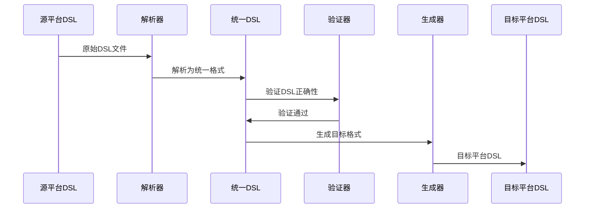

# AgentBridge

[English](README.en.md) | [简体中文](README.md)

> **业界首个跨平台AI智能体平台兼容工具**
>
> 仅需一个二进制文件，即可在本地实现不同AI智能体平台（iFlytek、Dify、Coze）间DSL文件的无缝互转，实现智能体工作流生态互通。以 iFlytek（科大讯飞星辰）为中枢，统一解析为中间 DSL，再按目标平台生成，支持自动识别、并发批量与严格校验。

---

## 目录
- [项目概览](#overview)
- [可视化](#visuals)
- [快速上手](#quickstart)
- [CLI 命令参考](#cli)
- [开发与测试](#dev)
- [常见问题](#faq)
- [许可与致谢](#license)

---

<a id="overview"></a>
## 项目概览

### 支持的转换链路
- Dify ↔ iFlytek（双向）
- Coze ↔ iFlytek（双向，YAML）
- Dify → iFlytek → Coze（推荐链路）
- Coze → iFlytek → Dify
- Coze ZIP → iFlytek（原生支持）

不支持：
- Dify ↔ Coze 直接转换（请通过 iFlytek 中转）
- iFlytek → Coze ZIP（当前不支持 ZIP 目标格式）

### 容错与占位策略
为保持工作流结构完整，当遇到目标平台暂不支持的节点类型时：
- 使用"代码节点（code）"作为占位符替换该节点
- 在代码节点标题中写明原节点的具体类型，便于后续手动调整
- 保留入/出边连接关系，流程可继续运行
- `--verbose` 下输出明细与统计，如：
  - Converting unsupported node type '4' (ID: 133604) to code node placeholder
  - 25 unsupported nodes were converted to code node placeholders

### 核心特性
- 并发批量：`batch` 命令按 CPU 并发，支持文件模式与覆盖
- 校验链路：结构/语义/平台三级校验，错误信息友好
- 节点覆盖：start / end / llm / code / condition / classifier / iteration

### Coze YAML 支持
- 现状：Coze 官方工作流不支持 YAML 导入/导出
- 方案：我们维护了一个 fork，提供 YAML 导入导出能力
- 仓库：`https://github.com/2064968308github/coze_transformer`
- 用法：先用该仓库得到 Coze YAML，再使用本工具跨平台转换（例如 Coze YAML → iFlytek，或 iFlytek → Coze YAML）


<a id="visuals"></a>
## 可视化

<a id="visuals-paths"></a>
### 转换路径示意


<a id="visuals-seq"></a>
### 转换流程时序图


<a id="visuals-arch"></a>
### 项目文件结构
```
agentbridge/
├── cmd/                    # CLI 入口
│   ├── main.go            # 主程序
│   ├── convert.go         # 转换命令
│   └── validate.go        # 验证命令
├── core/                  # 核心服务
│   └── services/          # 转换服务实现
├── platforms/             # 平台实现
│   ├── iflytek/          # 星辰平台
│   ├── dify/             # Dify平台
│   └── coze/             # Coze平台
├── internal/             # 内部模型
│   └── models/           # 统一DSL定义
└── registry/             # 策略注册
```

<a id="visuals-png"></a>
### 项目架构示意图


<a id="quickstart"></a>
## 快速上手

<a id="build"></a>
### 安装与构建

**环境要求：Go 1.21+**

#### Windows（推荐）
```powershell
# 确保已安装 Go 1.21+
go version

# 构建项目
go build -o agentbridge.exe ./cmd/
./agentbridge.exe --help
```
若目录存在同名"无扩展名"文件，PowerShell 可能弹出"选择应用打开"。只保留 `.exe` 即可。

#### macOS / Linux
```bash
# 确保已安装 Go 1.21+
go version

# 构建项目
go build -o agentbridge ./cmd/
chmod +x ./agentbridge
./agentbridge --help
```

### 使用示例
以下示例在项目根目录执行。

### Windows（PowerShell）
```powershell
# iFlytek → Dify
./agentbridge.exe convert --from iflytek --to dify --input agent.yml --output dify.yml

# Dify → iFlytek
./agentbridge.exe convert --from dify --to iflytek --input dify.yml --output agent.yml

# iFlytek → Coze（YAML）
./agentbridge.exe convert --from iflytek --to coze --input agent.yml --output coze.yml

# Coze ZIP → iFlytek（ZIP 自动识别为 Coze）
./agentbridge.exe convert --to iflytek --input workflow.zip --output agent.yml --verbose

# 批量（并发、覆盖）
./agentbridge.exe batch --from iflytek --to dify --input-dir .\tests\fixtures\iflytek --pattern 'iflytek*.yml' --output-dir .\out --workers 4 --overwrite

# 验证 DSL
./agentbridge.exe validate --input agent.yml

# 静默模式（仅错误输出）
./agentbridge.exe convert --from iflytek --to dify --input agent.yml --output dify.yml --quiet
```
提示：必须使用 `.exe`；`--pattern` 建议用单引号。

### macOS / Linux（Terminal）
```bash
# iFlytek → Coze（YAML）
./agentbridge convert --from iflytek --to coze --input agent.yml --output coze.yml

# Dify → iFlytek
./agentbridge convert --from dify --to iflytek --input dify.yml --output agent.yml

# 自动识别（YAML）
./agentbridge convert --to dify --input agent.yml --output dify.yml --verbose

# 批量（默认并发）
./agentbridge batch --from iflytek --to dify --input-dir ./workflows --output-dir ./converted --workers 8 --overwrite

# 验证
./agentbridge validate --input agent.yml
```

<a id="cli"></a>
## CLI 命令参考（完整）
以下示例默认在项目根目录执行；Windows 用 `./agentbridge.exe`，macOS/Linux 用 `./agentbridge`。

### convert
- 用途：跨平台转换
- 必选：`--to`、`--input/-i`、`--output/-o`
- 可选：`--from`（省略时自动识别，ZIP→Coze）
- 限制：不支持 Dify↔Coze 直连；不支持 iFlytek→Coze ZIP

### validate
- 用途：校验 DSL（结构/语义/平台）
- 必选：`--input/-i`
- 可选：`--from`（省略时自动识别）

### batch
- 用途：并发批量转换
- 必选：`--from`、`--to`、`--input-dir`、`--output-dir`
- 可选：`--pattern`（默认 `*.yml`）、`--workers`（默认按 CPU）、`--overwrite`、全局 `--quiet/--verbose`

### info
- 用途：查看能力说明
- 选项：`--nodes`、`--types`、`--all`

### platforms
- 用途：查看支持平台与状态
- 选项：`--detailed`

### completion（可选）
- 用途：生成 shell 自动补全
- PowerShell（临时加载）：
  - `agentbridge.exe completion powershell | Out-String | Invoke-Expression`
- PowerShell（持久化到 Profile）：
  - `agentbridge.exe completion powershell | Out-File -Encoding UTF8 $PROFILE`
- Bash：`agentbridge completion bash > /etc/bash_completion.d/agentbridge`
- Zsh：`agentbridge completion zsh > "${fpath[1]}/_agentbridge"`

<a id="dev"></a>
## 开发与测试
```bash
go fmt ./...
go vet ./...
go test ./... -cover
```

<a id="faq"></a>
## 常见问题
- Windows 弹“选择应用打开”：只保留并运行 `agentbridge.exe`
- Coze ZIP 自动识别：内部优先判定为 Coze，无需显式 `--from`
- Dify ↔ Coze 直连：不支持，请经 iFlytek 中转
- 输出 Coze ZIP：暂不支持（支持 YAML；或先用上文 fork 获取 YAML）
- 批量 `--pattern`：PowerShell 用单引号，Linux/macOS 单/双引号均可
- 静默：`--quiet` 仅错误时输出

<a id="license"></a>
## 许可与致谢
- 许可：见 LICENSE
- Coze YAML 能力参考并基于社区实现的 fork 改造：`https://github.com/2064968308github/coze_transformer`
