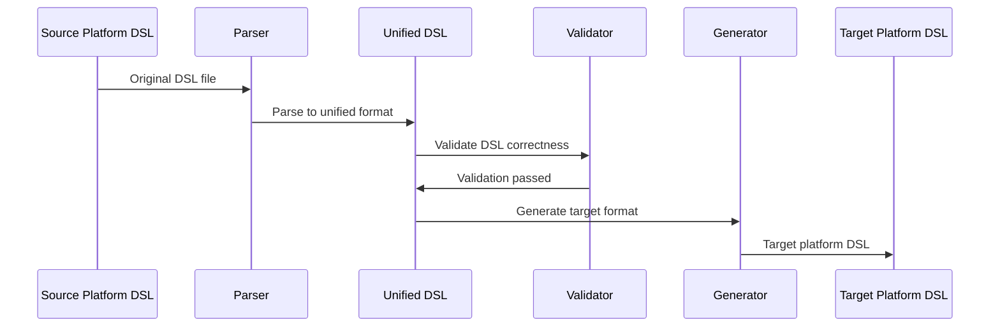

# AgentBridge

> **The world's first cross-platform AI agent platform compatibility tool**
>
> With just a single binary file, you can locally achieve seamless conversion of DSL files between different AI agent platforms (iFlytek, Dify, Coze), enabling AI agent workflow ecosystem interoperability. Using iFlytek (Spark Agent) as the hub, it unifies parsing into intermediate DSL, then generates according to the target platform, supporting automatic recognition, concurrent batch processing, and strict validation.

---

## Table of Contents
- [Project Overview](#overview)
- [Visualization](#visuals)
- [Quick Start](#quickstart)
- [CLI Reference](#cli)
- [Development & Testing](#dev)
- [FAQ](#faq)
- [License & Credits](#license)

---

<a id="overview"></a>
## Project Overview

### Supported Conversion Paths
- Dify ↔ iFlytek (bidirectional)
- Coze ↔ iFlytek (bidirectional, YAML)
- Dify → iFlytek → Coze (recommended path)
- Coze → iFlytek → Dify
- Coze ZIP → iFlytek (native support)

Not supported:
- Dify ↔ Coze direct conversion (please use iFlytek as hub)
- iFlytek → Coze ZIP (currently does not support ZIP target format)

### Fault Tolerance & Placeholder Strategy
To maintain workflow structure integrity when encountering node types not supported by the target platform:
- Use "code node" as placeholder to replace the node
- Write the original node's specific type in the code node title for easy manual adjustment later
- Preserve input/output edge connections so the flow can continue running
- Under `--verbose`, output details and statistics, such as:
  - Converting unsupported node type '4' (ID: 133604) to code node placeholder
  - 25 unsupported nodes were converted to code node placeholders

### Core Features
- Concurrent batch: `batch` command uses CPU concurrency, supports file mode and overwrite
- Validation pipeline: structure/semantic/platform three-level validation with friendly error messages
- Node coverage: start / end / llm / code / condition / classifier / iteration

### Coze YAML Support
- Current status: Coze official workflow does not support YAML import/export
- Solution: We maintain a fork that provides YAML import/export capabilities
- Repository: `https://github.com/2064968308github/coze_transformer`
- Usage: First use that repository to get Coze YAML, then use this tool for cross-platform conversion (e.g., Coze YAML → iFlytek, or iFlytek → Coze YAML)

<a id="visuals"></a>
## Visualization

<a id="visuals-paths"></a>
### Conversion Path Diagram


<a id="visuals-seq"></a>
### Conversion Flow Sequence Diagram


<a id="visuals-arch"></a>
### Project File Structure
```
agentbridge/
├── cmd/                    # CLI entry point
│   ├── main.go            # Main program
│   ├── convert.go         # Convert command
│   └── validate.go        # Validate command
├── core/                  # Core services
│   └── services/          # Conversion service implementation
├── platforms/             # Platform implementations
│   ├── iflytek/          # iFlytek platform
│   ├── dify/             # Dify platform
│   └── coze/             # Coze platform
├── internal/             # Internal models
│   └── models/           # Unified DSL definitions
├── main.go               # Root entry point for go install
└── registry/             # Strategy registry
```

<a id="visuals-png"></a>
### Project Architecture Diagram


<a id="quickstart"></a>
## Quick Start

<a id="build"></a>
### Installation

**Requirements: Go 1.21+**

#### Option 1: Direct Installation (Recommended)
```bash
# Install from GitHub (requires Go 1.21+)
go install github.com/iflytek/agentbridge@latest

# Verify installation
agentbridge --version
agentbridge --help
```

#### Option 2: Build from Source
```bash
# Clone the repository
git clone https://github.com/iflytek/agentbridge.git
cd agentbridge

# Build
go build -o agentbridge .

# Run
./agentbridge --help
```

### Usage Examples

#### Basic Conversions
```bash
# iFlytek → Dify
agentbridge convert --from iflytek --to dify --input agent.yml --output dify.yml

# Dify → iFlytek
agentbridge convert --from dify --to iflytek --input dify.yml --output agent.yml

# iFlytek → Coze (YAML)
agentbridge convert --from iflytek --to coze --input agent.yml --output coze.yml

# Coze ZIP → iFlytek (ZIP auto-detected as Coze)
agentbridge convert --to iflytek --input workflow.zip --output agent.yml --verbose
```

#### Batch Processing
```bash
# Concurrent batch conversion
agentbridge batch --from iflytek --to dify --input-dir ./workflows --output-dir ./converted --workers 4 --overwrite

# With pattern filtering
agentbridge batch --from iflytek --to dify --input-dir ./tests/fixtures/iflytek --pattern "iflytek*.yml" --output-dir ./out --workers 4 --overwrite
```

#### Validation
```bash
# Validate DSL file
agentbridge validate --input agent.yml

# Quiet mode (errors only)
agentbridge convert --from iflytek --to dify --input agent.yml --output dify.yml --quiet
```

<a id="cli"></a>
## CLI Reference

### convert
- Purpose: Cross-platform conversion
- Required: `--to`, `--input/-i`, `--output/-o`
- Optional: `--from` (auto-detected when omitted, ZIP→Coze)
- Limitations: No Dify↔Coze direct connection; No iFlytek→Coze ZIP

### validate
- Purpose: Validate DSL (structure/semantic/platform)
- Required: `--input/-i`
- Optional: `--from` (auto-detected when omitted)

### batch
- Purpose: Concurrent batch conversion
- Required: `--from`, `--to`, `--input-dir`, `--output-dir`
- Optional: `--pattern` (default `*.yml`), `--workers` (default by CPU), `--overwrite`, global `--quiet/--verbose`

### info
- Purpose: View capability descriptions
- Options: `--nodes`, `--types`, `--all`

### platforms
- Purpose: View supported platforms and status
- Options: `--detailed`

### completion (optional)
- Purpose: Generate shell auto-completion
- Bash: `agentbridge completion bash > /etc/bash_completion.d/agentbridge`
- Zsh: `agentbridge completion zsh > "${fpath[1]}/_agentbridge"`
- PowerShell: `agentbridge completion powershell | Out-String | Invoke-Expression`

<a id="dev"></a>
## Development & Testing
```bash
go fmt ./...
go vet ./...
go test ./... -cover
```

<a id="faq"></a>
## FAQ
- **Installation Issues**: Ensure Go 1.21+ is installed and `$GOPATH/bin` is in your PATH
- **Coze ZIP Auto-detection**: Internally prioritized as Coze, no need for explicit `--from`
- **Dify ↔ Coze Direct**: Not supported, please relay through iFlytek
- **Output Coze ZIP**: Not yet supported (supports YAML; or use the fork mentioned above for YAML)
- **Batch `--pattern`**: Use quotes around patterns with special characters
- **Quiet Mode**: `--quiet` outputs only on errors

<a id="license"></a>
## License & Credits
- License: See LICENSE
- Coze YAML capability reference and based on community-implemented fork: `https://github.com/2064968308github/coze_transformer`
